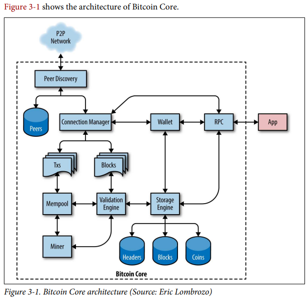

[toc]
# Bitcoin Core 比特币核心

比特币，并不单单指一种最为人熟知的虚拟货币（加密货币），更重要的是，它是一个遵守[MIT协议](https://en.wikipedia.org/wiki/MIT_License)的开源项目。比特币是一个被广泛认可、众多人参与并维持了一个繁荣的社区了的项目。
比特币的发明者是中本聪(Satoshi Nakamoto)，中本聪在发表他的那篇开启了一个新时代的白皮书以前，就已经完成了第一代的比特币项目。第一个版本(the first implementation)，被后来人称为"Satoshi client"或"Bitcoin"。之后的开发者社区基于第一个版本不断改进、迭代，形成了更为成熟的比特币项目。为了将后面的工作与中本聪的第一代项目区分开，我们把现在广泛使用的、迭代成熟的项目称为"Bitcoin Core"。我们认为，"Bitcoin Core"是比特币系统的一个“官方”的参考实现(authoritative reference implementation of bitcoin system).

Bitcoin Core包含了所有bitcoin系统需要的组成部件，包含：
1. 钱包 wallets
2. 一个交易和区块验证引擎 a transaction and block validation engine
3. 一个处于端到端比特币网络中的完全数据节点 a full network node in the peer-to-peer bitcoin network

## 安装并编译比特币核心
在GitHub上找到Bitcoin项目，下载zip文件或直接使用git工具将源代码下载到你的计算机中。你会得到一个bitcoin文件夹(/bitcoin)，进入该文件夹后右键打开terminal（终端），这时你应该在bitcoin文件夹中进行下一步操作。
关于github的使用，如果你没有基础，请参考：[B站-『教程』一看就懂！Github基础教程](https://www.bilibili.com/video/BV1hS4y1S7wL?share_source=copy_web)

请注意，还有一些更加简单的方法来下载并直接使用Bitcoin Core.你可以不用在你的计算机上编译源码也可以获得Bitcoin Core应用。参考：[Youtube-Bitcoin Core Wallet | Bitcoin Core Wallet and Full Node Tutorial](https://youtu.be/kUfOBIFSfbg)。如果你选择了这个方法，那么下面标注（可选）的内容将不再需要阅读。
### 选择一个Bitcoin Core版本（可选）
在终端中使用命令
>git tag

你会看到比特币核心自诞生以来所有发布的版本。我们建议使用最新的稳定版本（即没有rc-release candidate标识符的版本）。目前(2022/7/15)的适合版本是v23.0。
按下'q'键来推出tag命令的交互模式(interactive mode)，使用命令
>git checkout v23.0

之后你可以使用
>git status

来检查你是否切换到了目标版本。

### 在windows系统下进行源文件编译（可选）
我们以管理员身份打开windows终端，使用以下命令（我们默认使用ubuntu进行安装）：
>wsl --install -d Ubuntu

正常情况下，在下载完Ubuntu后会要求重启，之后按照指引配置Ubuntu用户。
注意在输入密码时是不会显示出来的，不用怀疑是不是自己的键盘或者显示屏出了问题。

如果这一步有任何问题，请参考windows的[wsl项目](https://docs.microsoft.com/zh-cn/windows/wsl/install)。

### 在WSL-Ubuntu中进行编译（可选）
此时你可以在*Windows开始-应用*中找到Ubuntu，点击打开之后应当是一个命令行形式的输入窗口。Ubuntu安装在C盘中，之后的工作都在C盘中完成。
接下来的第一步是将之前安装的Bitcoin项目复制或剪切到Utubun系统下的存储位置。
或者你可以直接在Ubuntu的命令行窗口中输入
>git clone https://github.com/bitcoin/bitcoin.git
cd bitcoin

之后按照先前说明的步骤选择合适的Bitcoincore版本。

### 安装编译所依赖的库（可选）
>sudo apt-get install make
sudo apt-get install gcc
sudo apt-get install g++
sudo apt-get install build-essential
sudo apt-get install libtool
sudo apt-get install autotools-dev
sudo apt-get install autoconf
sudo apt-get install pkg-config
sudo apt-get install libssl-dev
sudo apt-get install libevent-dev
sudo apt-get install libboost-all-dev
sudo apt-get install libminiupnpc-dev
sudo apt-get install libqt4-dev
sudo apt-get install libprotobuf-de
sudo apt-get install protobuf-compiler
sudo apt-get install libqrencode-dev
sudo apt-get install libdb-dev
sudo apt-get install libdb++-dev

这些库的作用五花八门，libevent-dev帮助实现网络通信功能、libssl-dev实现密码算法加密解密功能（比如说比特币仰赖的椭圆曲线密码算法）...等等等等

之后你可以用
>./autogen.sh
./configure

两个命令来做编译前最后的检查准备。

### 编译、安装（可选）
使用命令：
>make
sudo make install

其中第二个命令需要你输入Ubuntu的密码。之后整个程序会安装到/usr/local/bin目录下。

# 建议阅读的文献——提升对bitcoin的使用、开发与维护的认识
[腾讯云社区-Bitcoin Core冷钱包教程](https://cloud.tencent.com/developer/article/1442297)
